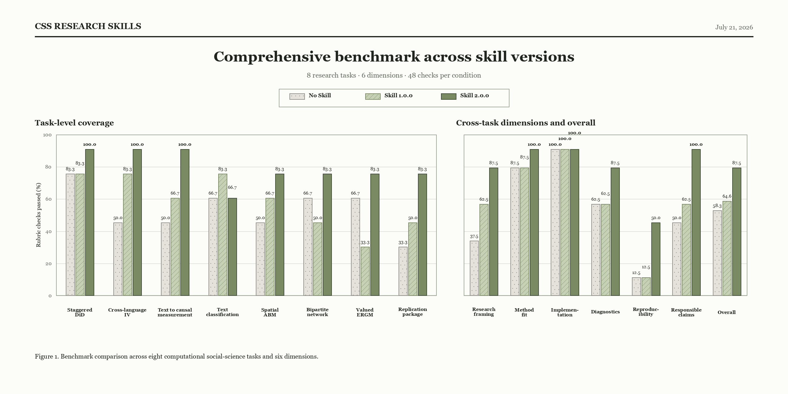

<div align="center">

# CSS Research Skills

**Research-design-first guidance for computational social science agents**

Turn a social-science question into an inspectable analysis across causal inference, text as data, agent-based modelling, and network science—without treating runnable code as sufficient evidence.

[](css-research-skills/SKILL.md)
[](https://agentskills.io/)
[](LICENSE)

[简体中文](README.zh.md) · [Quick start](#quick-start) · [Benchmark](#benchmark)

</div>

## Why this Skill?

General-purpose coding agents can produce plausible analyses while silently changing the estimand, skipping construct validation, using an obsolete package API, or calling a pipeline “reproducible” because it has a fixed seed. `css-research-skills` adds the research contract and validity checks needed between a question and a claim.

It helps an agent:

- distinguish description, prediction, measurement, causal identification, and simulation explanation;
- route mixed projects to every relevant domain instead of forcing one method label;
- connect code, diagnostics, robustness checks, provenance, ethics, and final claims;
- load detailed guidance only when the task needs it.

The Skill supports researcher judgment; it does not replace subject-matter expertise, ethics review, or identification arguments.

## Quick start

Clone the repository, then copy the inner directory—the one containing `SKILL.md`—to the skill directory used by your agent:

```bash
git clone https://github.com/MingfengHong/css-research-skills.git
cp -R css-research-skills/css-research-skills ~/.claude/skills/css-research-skills
```

Other Agent Skills-compatible tools can use the same inner directory; only the installation location changes.

Then try a real research task:

```text
Audit my staggered-adoption DiD design. Define the estimand, flag invalid
comparisons, propose diagnostics, and give an implementation plan in R.
```

```text
Design a multilingual text-measurement pipeline for a causal study. Include
annotation, validity evidence, preprocessing sensitivity, and sample splitting.
```

```text
Review this Mesa model and network-analysis pipeline for API compatibility,
ODD documentation, simulation validation, community robustness, and provenance.
```

## What it covers

| Area | Guidance included |
|---|---|
| Causal inference | Target trials, DAGs, experiments, regression adjustment, panel designs, modern DiD/event studies, RDD, IV, matching/weighting, longitudinal analyses |
| Text as data / NLP | Corpus design, representation, discovery, construct measurement, annotation, classification, embeddings, LLM coding, text in causal workflows |
| Agent-based modelling | ODD 2020, Mesa version gates, conceptual models, calibration, validation, invariants, sensitivity and Monte Carlo uncertainty |
| Network analysis | Network construction, centrality, communities, bipartite and temporal networks, null models, power laws, ERGM/TERGM |
| Reproducible research | Provenance, raw/derived/analysis data separation, environment capture, executable workflows, restricted data, responsible computing |

## What changed in 2.0.0

- Replaced rigid defaults with design-dependent decisions and explicit validity gates.
- Added modern staggered-adoption DiD, text-measurement validity and sample splitting, ODD 2020, Mesa version gates, Leiden stability, valid power-law assessment, and ERGM 4 guidance.
- Expanded reproducibility from “seed + output folder” to provenance, metadata, environment capture, master execution, output mapping, and restricted-data instructions.
- Added stakeholder, privacy, foreseeable-harm, dual-use, and mitigation checks.

## Benchmark

The expanded benchmark covers eight tasks: staggered DiD, cross-language IV, multilingual text measurement, imbalanced text classification, spatial ABM, bipartite networks, valued ERGM, and a restricted-data replication package. Every response is assessed on six dimensions: research framing, method fit, implementation, diagnostics, reproducibility, and responsible claims.



| Condition | Checks passed | Pass rate | Difference from No Skill |
|---|---:|---:|---:|
| No Skill | 28/48 | 58.3% | — |
| Skill 1.0.0 | 31/48 | 64.6% | +6.3 pp |
| Skill 2.0.0 | 42/48 | 87.5% | +29.2 pp |

The broader matrix includes areas emphasized by 1.0.0. Skill 2.0.0 leads overall, while 1.0.0 scores higher on the imbalanced text-classification task (5/6 versus 4/6).

See the [complete task and dimension results](benchmarks/README.md).

## Acknowledgements

The community-oriented presentation is inspired by [nuwa-skill](https://github.com/alchaincyf/nuwa-skill) and [academic-research-skills](https://github.com/Imbad0202/academic-research-skills).

## License

[CC BY-NC 4.0](LICENSE). You may share and adapt the work with attribution for non-commercial use.
